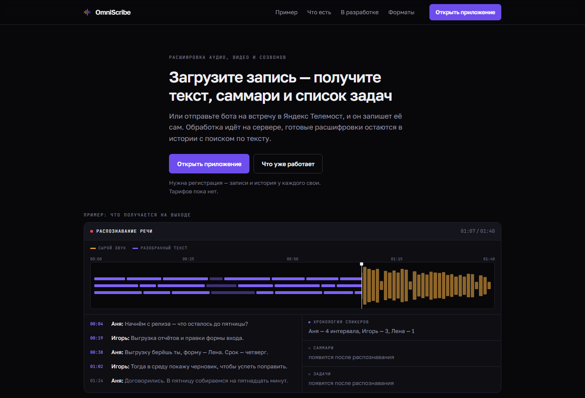
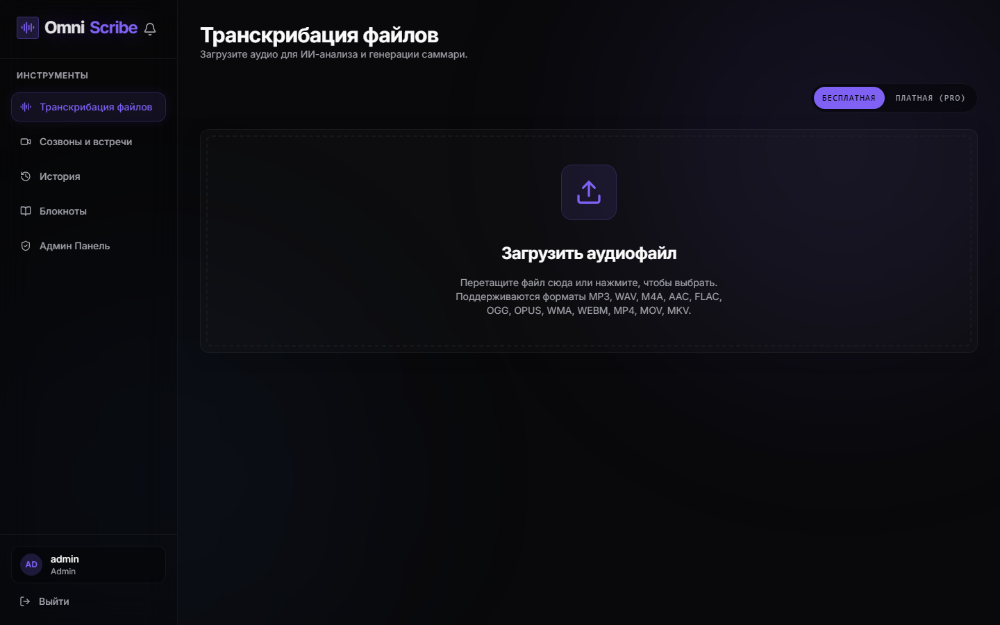
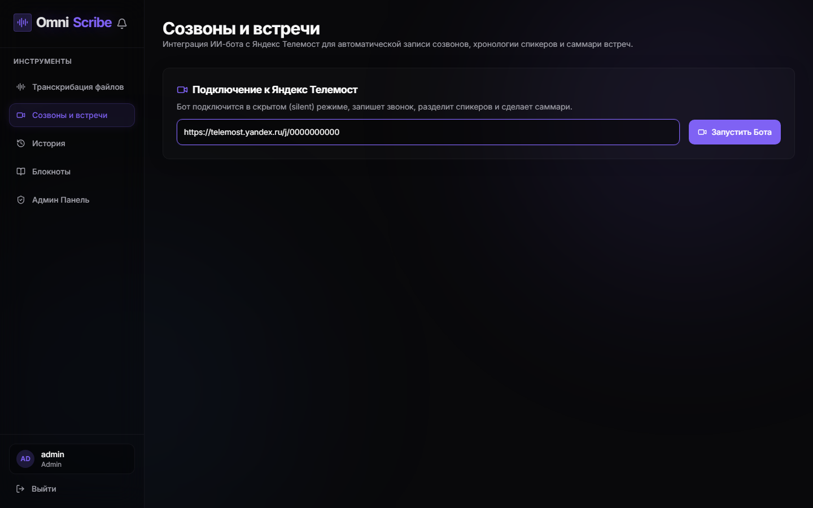

# OmniScribe

Веб-приложение: загрузить аудио — получить транскрипт, саммари и action items.
Второй вход — ссылка на встречу в Яндекс Телемосте: бот заходит в созвон, пишет звук
и прогоняет ту же обработку.

Исходный код закрыт. Здесь — устройство системы и решения, которые за ним стоят.
Код покажу на собеседовании, доступ на чтение дам по запросу.

ASP.NET Core 8 · EF Core, SQLite · Cookie auth · React, TypeScript, Vite ·
Playwright, Chromium · MediaRecorder · FFmpeg · whisper.cpp · SSE · Docker

## Как выглядит

<p align="center">

</p>
<p align="center">


</p>

## Архитектура

У Телемоста нет API записи. Звук берётся из того же WebRTC, что слышит браузер.

```
Пользователь
  ├── загрузка файла ──────────────────────────────┐
  └── ссылка Telemost → Playwright Chromium        │
                         JS в странице перехватывает│
                         remote audio tracks        │
                         MediaRecorder → WebM       │
                         FFmpeg → MP3 / WAV 16 кГц  │
                                                    ▼
                              TranscriptionService
                         free:  whisper.cpp в контейнере
                         paid:  Polza → whisper.cpp fallback
                                                    │
                         саммари, рекомендации, action items
                                                    ▼
                              SQLite  +  SSE → только владельцу
```

Один процесс ASP.NET Core отдаёт API, статику фронта, SSE и поднимает бота.
Фронт собирается Vite в `wwwroot`. Sidecar на Playwright отдельно ходит
в NotebookLM по сессии пользователя — основной пайплайн от него не зависит.

Лимит: не больше двух ботов одновременно. Третий старт отклоняется, пока
кто-то не остановит запись.

## Решения

### Запись создаётся до старта Chromium

По ссылке сразу пишется строка со статусом `recording`, и по SSE она улетает
во фронт. Пользователь видит «идёт запись» до того, как браузер открыл встречу.
Остановить можно по `recordId` — сессия живёт в словаре, останавливает только
владелец.

Статусы: `recording` → `processing` → `done` | `error`. Запись в статусе
`recording` удалить нельзя, пока бот не остановлен.

### WebRTC перехватывается в странице, не через API Телемоста

В Chromium инжектится init-script до загрузки встречи:

- каждый remote audio track регистрируется как «Спикер N»;
- скрытые `<audio>` заставляют браузер декодировать поток — без этого
  MediaRecorder на remote WebRTC часто пишет тишину;
- все треки сходятся в один `MediaStream`, `MediaRecorder` режет куски по 3 с;
- по энергии треков строится timeline, кто говорил и в какие секунды.

После остановки WebM сжимается в MP3 через FFmpeg. Если конвертация падает —
остаётся сырой WebM, пайплайн не обрывается.

### Транскрибация не обязана уходить в облако

Перед распознаванием аудио приводится к WAV 16 кГц mono PCM.

- бесплатный режим — `whisper-cli` внутри того же Docker-образа, модель
  `ggml-base`, язык `ru`;
- платный — сначала Polza (OpenAI-совместимый API), при ошибке тот же
  локальный whisper.cpp;
- Groq оставлен как выключенный по умолчанию fallback.

Файл больше 24 МБ режется на куски: лимит облачных STT — 25 МБ.

### SSE адресован человеку, не комнате

`GET /api/events/stream` держит канал по `userId`. Событие уходит только
владельцу записи, соседние сессии его не видят.

Регистрация по умолчанию с `IsApproved = false`. Доступ выдаёт админ.
Регистрации с одного IP режутся лимитером.

## Проверка

Сборка: `dotnet build`, `npm run lint` во фронте.
Образ Docker собирает `whisper.cpp` и модель на этапе build — бесплатный
режим не требует внешнего ключа.

## Статус

Рабочий сервис: загрузка файлов, запись Телемоста, история, админка, деплой
через Docker и GitHub Actions. Код и ключи провайдеров закрыты.
